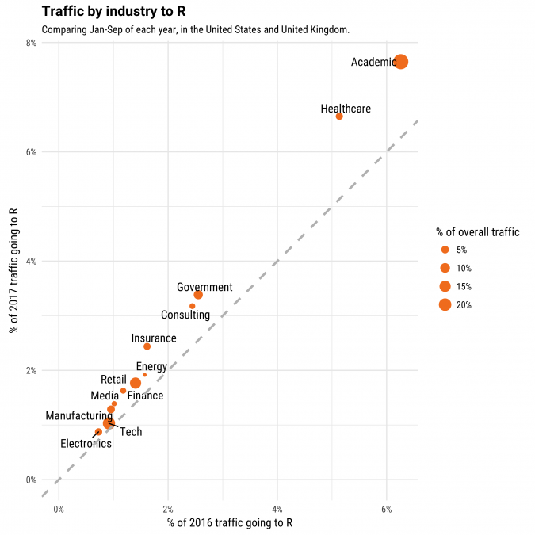
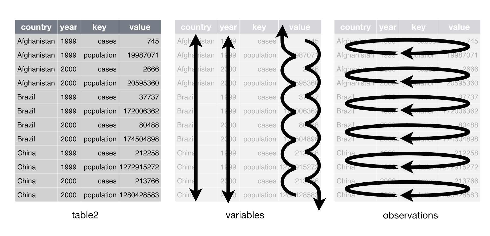
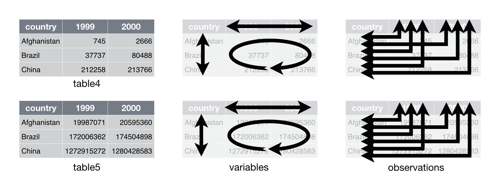

<style>
.reveal h1, .reveal h2, .reveal h3 {
  word-wrap: normal;
  -moz-hyphens: none;
}
.small-code pre code {
  font-size: 1em;
}
</style>

First Meeting: crash into R
========================================================
author: Eduard Bukin
date: 2018-02-21 
autosize: true
navigation: slide

Plan of the first meeting of the R-Users at IAMO
========================================================
transition: rotate
incremental: true
type: prompt

1. R and what is so cool about R! 
1. Main data types and structures: objects, vectors, `c()`, `list()`, `mattrix()`, `data.frame`, `$`, `[ ]`, `[[ ]]`  
1. Packages: `install.packages()`, `tidyverse`
1. __Get data in R__: `base::read.csv()` - why we should never use it; `readr::read_csv()`; `readxl:read_excel()`
1. Glance at data in R: `str()`; `glimpse()`; `tibble::tbl_df()`
1. __*tidy data*__
1. Basic grammar of data manipulation `dplyr`: `select()`, `filter()`, `mutate()`, `summaries()`, `group_by()`
1. How to learn? Where to get help to learn? Cheat sheets

R and what is so cool about R! 
====================================
type: section

Growth of R
========================================================


Least disliked language
========================================================


R-UseRs
========================================================
left:80%

***
[Most downloaded packages/authors](https://www.rdocumentation.org/trends?page1=1&sort1=total&page2=1&sort2=total&page3=1&page4=1)

Some other cool things
========================================================
transition: rotate
incremental: true
autosize: true
type: prompt

* Access and handle data with [tidyverse](https://www.tidyverse.org/) and [other tools](https://cran.r-project.org/doc/manuals/r-devel/R-data.html)
* Easy to analyse data with specifically developed tools [CRAN Task View](https://cran.r-project.org/web/views/)
* Build dynamic and interactive data visualization with [Shiny](http://shiny.rstudio.com/gallery/), [plotly](https://plot.ly/r/), and many [other widgets](http://www.htmlwidgets.org/showcase_plotly.html)
* Built [dashboards](http://jkunst.com/flexdashboard-highcharter-examples/pokemon/)
* Do reproducible research and dynamic documentations with [rmarkdown](https://rmarkdown.rstudio.com/gallery.html)
* Teach and learn in R with [swirl](http://swirlstats.com/students.html)


Some other cool things
========================================================
transition: rotate
incremental: true
autosize: true
type: prompt

* Do research
* Meet incredible R community:
  * With [Rstudio](https://www.rstudio.com/), R-studio [developers' blogs](https://blog.rstudio.com/) and [community](https://rviews.rstudio.com/)
  * With [The Comprehensive R Archive Network](https://cran.r-project.org/), with their __12 000+__ [packages in the repository](https://cran.r-project.org/web/packages/index.html) and [Task Views](https://cran.r-project.org/web/views/) 
  * Open source and publicly developed software using [github](https://github.com/rstudio)
  * Multiple communities: [R Open science](https://ropensci.org/), [stakexchange](https://stackoverflow.com/tags/r/info), [R-pubs](https://rpubs.com/) and many other things!


Moving to Tutorial in R
====================================
type: section

# Main data types and structures
# Packages: `install.packages()`, `tidyverse`
# Get data in R: `readr::read_csv()`; `readxl:read_excel()`

Tidy data
====================================
type: section

# What is tidy?
# How to make it tidy?
# Get data in R: `readr::read_csv()`; `readxl:read_excel()`


Data sets examples 1
====================================

```r
DSR::table1
```

```
      country year  cases population
1 Afghanistan 1999    745   19987071
2 Afghanistan 2000   2666   20595360
3      Brazil 1999  37737  172006362
4      Brazil 2000  80488  174504898
5       China 1999 212258 1272915272
6       China 2000 213766 1280428583
```

```r
DSR::table3
```

```
      country year              rate
1 Afghanistan 1999      745/19987071
2 Afghanistan 2000     2666/20595360
3      Brazil 1999   37737/172006362
4      Brazil 2000   80488/174504898
5       China 1999 212258/1272915272
6       China 2000 213766/1280428583
```

Data sets examples 1 - structure
========================================================


Data sets examples 2
====================================

```r
DSR::table2
```

```
       country year        key      value
1  Afghanistan 1999      cases        745
2  Afghanistan 1999 population   19987071
3  Afghanistan 2000      cases       2666
4  Afghanistan 2000 population   20595360
5       Brazil 1999      cases      37737
6       Brazil 1999 population  172006362
7       Brazil 2000      cases      80488
8       Brazil 2000 population  174504898
9        China 1999      cases     212258
10       China 1999 population 1272915272
11       China 2000      cases     213766
12       China 2000 population 1280428583
```

Data sets examples 2 - structure
========================================================


Data sets examples 3
====================================

```r
DSR::table4 # cases
```

```
      country   1999   2000
1 Afghanistan    745   2666
2      Brazil  37737  80488
3       China 212258 213766
```

```r
DSR::table5 # population
```

```
      country       1999       2000
1 Afghanistan   19987071   20595360
2      Brazil  172006362  174504898
3       China 1272915272 1280428583
```

Data sets examples 3 - structure
====================================


Tidy data
====================================
Your data will be easier to work with in R if it follows three rules:

* Each variable in the data set is placed in its own column
* Each observation is placed in its own row
* Each value is placed in its own cell

Data that satisfies these rules is known as tidy data.

Borrowed from [Data science with R: Tidying](http://garrettgman.github.io/tidying/)

Tidy data example - structure
====================================


Tidy data example
====================================

```r
DSR::table1
```

```
      country year  cases population
1 Afghanistan 1999    745   19987071
2 Afghanistan 2000   2666   20595360
3      Brazil 1999  37737  172006362
4      Brazil 2000  80488  174504898
5       China 1999 212258 1272915272
6       China 2000 213766 1280428583
```

How to make tidy data?
====================================
type: prompt

Use R package `tidyr`.  

Functions:
* `spread()`
* `gather()`

spread()
====================================


gather()
====================================


Non-tidy data
====================================
Be aware, that sometimes, data cannot be tidy and in fact is it easier to work with such data. 

For more information, see [Non-tidy data](https://simplystatistics.org/2016/02/17/non-tidy-data/).

Where to go next?
====================================
type: section
# Data manipulation with `dplyr` - meeting

* `select()`
* `filter()`
* `distinct()`
* `mutate()`
* `summarise()`
* `arrange()` and others operations with data.

Resources - where are how to learn?
========================================================

PRACTICE
* refer to the [R Studio cheetsheets](https://www.rstudio.com/resources/cheatsheets/);

Read:
* [R for Data Science](http://r4ds.had.co.nz/);
* [Official CRAN documentation](https://cran.r-project.org/manuals.html) (sometimes boring to read);
* Search questions and answers on [stakexchange](https://stackoverflow.com/tags/r/info);
* [r pubs](http://rpubs.com/);
* [CRAN Task View](https://cran.r-project.org/web/views/);
* [R Studio Community](https://community.rstudio.com/);


Resources - where are how to learn?
========================================================


Learn:
* [TRY SWIRL](http://swirlstats.com/);
* E-courses [DataCamp](https://www.datacamp.com/courses/free-introduction-to-r), [coursera - R prodgramming](https://www.coursera.org/learn/r-programming), [edx - Statistics in R](https://www.edx.org/course/statistics-r-harvardx-ph525-1x-1), [edx - R programming](https://www.edx.org/course/introduction-r-data-science-microsoft-dat204x-7).;
* do [excersise](https://r-exercises.com/);
* see [R by example](http://www.mayin.org/ajayshah/KB/R/index.html);

Some other resources:
  * [Impatient R](http://www.burns-stat.com/documents/tutorials/impatient-r/)
  * [R Wikibooks](https://en.wikibooks.org/wiki/R_Programming)
  * [Examples of data analysis in R](https://stats.idre.ucla.edu/other/dae/)
  
Google

Thank you
========================================================
type: section

  
