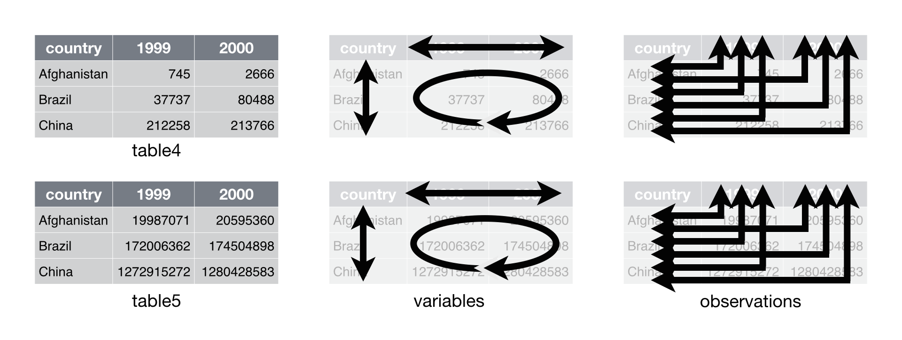

## Plan of the first meeting of the R-Users at IAMO  {.build}

1. __Get data in R__: `base::read.csv()` - why we should never use it; `readr::read_csv()`; `readxl:read_excel()`
1. Glance at data in R: `str()`; `glimpse()`; `tibble::tbl_df()`
1. Basic grammar of data manipulation `dplyr`: `select()`, `filter()`, `mutate()`, `summaries()`, `group_by()`
1. __*tidy data*__

---

## To the R code

---

## Tidy data

* What is tidy?
* How to make it tidy?
* Get data in R: `readr::read_csv()`; `readxl:read_excel()`

---

## Data sets examples 1 (1)

```{r echo = FALSE}
DSR::table3
```

---

## Data sets examples 1 - structure

```{r echo = FALSE, out.width="100%"}
knitr::include_graphics("figures/tidy-6.png")
```

---

## Data sets examples 2

```{r echo = FALSE}
DSR::table2
```

---

## Data sets examples 2 - structure

```{r echo = FALSE, out.width="100%"}
knitr::include_graphics("figures/tidy-5.png") 
```

---

## Data sets examples 3

```{r echo = FALSE}
DSR::table4 # cases
DSR::table5 # population
```

---

## Data sets examples 3 - structure
```{r echo = FALSE, out.width="100%"}

```

---

## Tidy data

Your data will be easier to work with in R if it follows three rules:

* Each variable in the data set is placed in its own column
* Each observation is placed in its own row
* Each value is placed in its own cell

Data that satisfies these rules is known as tidy data.

Borrowed from [Data science with R: Tidying](http://garrettgman.github.io/tidying/)

---

## Tidy data example - structure

```{r echo = FALSE, out.width="100%"}
knitr::include_graphics("figures/tidy-4.png")
```

---

## Tidy data example
```{r}
DSR::table1
```

---

## How to make tidy data?

Use R package `tidyr`.  

Functions:

* `spread()`
* `gather()`

---

## spread()
```{r echo = FALSE, out.width="100%"}
knitr::include_graphics("figures/tidy-8-spread.png")
```

---

## gather()
```{r echo = FALSE, out.width="100%"}
knitr::include_graphics("figures/tidy-8-gather.png")
```

---

## Non-tidy data

Be aware, that sometimes, data cannot be tidy and in fact is it easier to work with such data. 

For more information, see [Non-tidy data](https://simplystatistics.org/2016/02/17/non-tidy-data/).

---

## Where to go next?

Data manipulation with `dplyr` - next meeting

  
